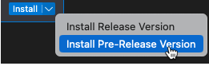
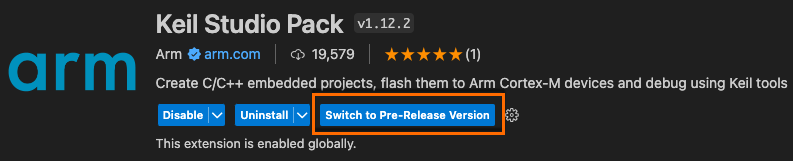

# Arm Keil Studio Pack for Visual Studio Code

## Overview

The Arm® Keil® Studio Pack installs recommended extensions for embedded and IoT software development on Arm-based microcontroller (MCU) devices. The extensions included are listed in the **Details** of the pack in Visual Studio Code and described in [Extensions available in the pack](#extensions-available-in-the-pack).

We recommend installing the Keil Studio Pack in Visual Studio Code Desktop to quickly set up your environment and start working with an example.

The main Keil Studio extensions available with the pack are Arm CMSIS csolution, Arm Device Manager and Arm Embedded Debugger. The extensions enable you to manage CMSIS solutions (csolution projects), run projects on a hardware and undertake debugging. The extensions can be used together or individually.

A pre-release of the Keil Studio Pack is also available and includes all the main extensions included in the offical pack and Arm Debugger, instead of the Embedded Debugger. The pre-release also includes the Memory Inspector and Peripheral Inspector extensions.

This Readme explains how to install the extensions with Visual Studio Code Desktop. When you have installed the pack, read the documentation available on Arm Developer to [get started with an example project](https://developer.arm.com/documentation/108029/latest/Get-started-with-an-example-project).

## Intended use cases for the extensions

- **Embedded and IoT software development using CMSIS-Packs and csolution projects**: The "Common Microcontroller Software Interface Standard" (CMSIS) provides driver, peripheral and middleware support for thousands of MCUs and hundreds of development boards. Using the csolution project format, you can incorporate any CMSIS-Pack based device, board, and software component into your application. For more information about supported hardware for CMSIS projects, go to the [Boards](https://www.keil.arm.com/boards/) and [Devices](https://www.keil.arm.com/devices/) pages on keil.arm.com. For information about CMSIS-Packs, go to [open-cmsis-pack.org](https://www.open-cmsis-pack.org/index.html).

- **Enhancement of a pre-existing Visual Studio Code embedded software development workflow**: USB device management and embedded debug can be adapted to other project formats (for example CMake) and toolchains without additional overhead. This use case requires familiarity with Visual Studio Code to configure tasks. See the individual extensions for more details.

## Extensions available in the pack

The extensions available are:

- Arm CMSIS csolution (Identifier: `arm.cmsis-csolution`): This extension provides support for working with CMSIS solutions (csolution projects).

- Arm Device Manager (Identifier: `arm.device-manager`): This extension allows you to manage hardware connections for Arm Cortex®-M based microcontrollers, development boards and debug probes.

- Arm Embedded Debugger (Identifier: `arm.embedded-debug`): This extension allows you to run and debug projects on Arm Cortex-M based microcontrollers, development boards and debug probes implementing the Microsoft Debug Adapter Protocol (DAP).

- Arm Environment Manager (Identifier: `arm.environment-manager`): This extension installs the tools you specify in a manifest file in your environment. For example, Arm Compiler for Embedded, CMSIS-Toolbox, CMake, and Ninja can be installed to work with CMSIS solutions.

- Arm Virtual Hardware (Identifier: `arm.virtual-hardware`): This extension allows you to manage Arm Virtual Hardware and run embedded applications on them. An authentication token is required to access the service.

**Note**: The Arm Virtual Hardware extension is experimental.

The pack also installs:

- Red Hat YAML (Identifier: `redhat.vscode-yaml`): This extension provides YAML syntax support when editing `csolution.yml` or `cproject.yml` files.

- Microsoft C/C++ (Identifier: `ms-vscode.cpptools`): This extension adds smart features such as code completion, compile errors, go-to-definition and more to your editor.

- Microsoft C/C++ Themes (Identifier: `ms-vscode.cpptools-themes`): This extension works in combination with Microsoft C/C++ to provide syntax highlighting.

## Install the extensions

1. In Visual Studio Code Desktop, go to the **Extensions** view.

1. Search for **Arm Keil Studio Pack**.

1. Click the **Install** button for the extension pack.

    Visual Studio Code installs the extensions.
    All recommended Keil Studio extensions are now available in the **Extensions** view. The pack also installs the Red Hat YAML, Microsoft C/C++, and Microsoft C/C++ Themes extensions.

    A pop up displays in the bottom right-hand corner with the message "Activate license for Arm tools?". See [Activate your license to use Arm tools](https://developer.arm.com/documentation/108029/latest/Activate-your-license-to-use-Arm-tools) for more details on licensing.

1. Click **Activate**.

## Arm Keil Studio Pack pre-release

The extensions only available in the pre-release are:

- Arm Debugger (Identifier: `arm.arm-debugger`): This extension provides access to the Arm Debugger engine for Visual Studio Code by implementing the Microsoft Debug Adapter Protocol (DAP). Arm Debugger supports connections to physical targets, either through external debug probes such as the Arm's ULINK™ family of debug probes, or through on-board low-cost debugging such as ST-Link or CMSIS-DAP based debug probes.

- Memory Inspector (Identifier: `eclipse-cdt.memory-inspector`): This extension allows you to analyze and monitor the memory contents in an embedded system. It helps you to identfiy and debug memory-related issues during the development phase of your project.

- Peripheral Inspector (Identifier: `eclipse-cdt.peripheral-inspector`): This extension uses System View Description (SVD) files to display peripheral details. SVD files provide a standardized way to describe the memory-mapped registers and peripherals of a microcontroller or a System-on-Chip (SoC).

To install the pre-release:

1. In Visual Studio Code Desktop, go to the **Extensions** view.

1. Search for **Arm Keil Studio Pack** and select it in the list of available extensions. 

    - If you did not have the official pack already installed, click the arrow next to the **Install** button and select **Install Pre-Release Version**.

    

    - If you have the official pack already installed, click the **Switch to Pre-Release Version** button on the welcome page that displays when you select the pack from the list.

    

## Submit feedback

To submit feedback, please [see our support page](https://www.keil.arm.com/support/#:~:text=Keil%20Studio%20for%20VS%20Code).
