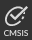

# Arm Keil Studio Pack for Visual Studio Code Desktop

## Overview

This extension pack installs recommended extensions for Keil Studio development. The extensions included are listed in the **Details** of the pack in Visual Studio Code and detailed in the [Extensions available in the pack](#extensions-available-in-the-pack) section below.

The main Keil Studio extensions available are **Arm CMSIS csolution**, **Arm Device Manager** and **Arm Embedded Debugger**. They can work in combination and enable you to manage CMSIS solutions (csolution projects), flash projects to a device and undertake debugging.

This Readme explains how to install the extensions with the **Keil Studio Pack** and gives you the main steps to set up your development environment (check the **CMSIS csolution** extension Readme to get the full details). Once your environment is ready, check the [Tutorial](#tutorial) to understand what you can do with the extensions.

For more information about supported hardware for CMSIS projects, go to [keil.arm.com](https://www.keil.arm.com/boards/). For an overview on CMSIS-Packs, go to [open-cmsis-pack.org](https://www.open-cmsis-pack.org/index.html).

## Submit feedback

To submit feedback, please [create an issue](https://github.com/Arm-Software/vscode-keil-studio-pack/issues/new/choose).

## Table of contents

1. [Extensions available in the pack](#extensions-available-in-the-pack)
1. [Install the extensions](#install-the-extensions)
1. [Main steps to set up your development environment](#main-steps-to-set-up-your-development-environment)
1. [Tutorial](#tutorial)
    - [Connect your board](#connect-your-board)
    - [Build the csolution project](#build-the-csolution-project)
    - [Flash the csolution project to your board](#flash-the-csolution-project-to-your-board)
    - [Launch a debug session](#launch-a-debug-session)
    - [Check the serial output of your board](#check-the-serial-output-of-your-board)

## Extensions available in the pack

The main extensions available are:

- **Arm CMSIS csolution** (Identifier: `arm.cmsis-csolution`): This extension provides support for working with CMSIS solutions (csolution projects).

- **Arm Device Manager** (Identifier: `arm.device-manager`): This extension allows you to manage device connections for Arm Cortex-M based microcontrollers, development boards and debug probes.

- **Arm Embedded Debugger** (Identifier: `arm.embedded-debug`): This extension allows you to do flashing and debugging on Arm Cortex-M based microcontrollers, development boards and debug probes implementing the Microsoft Debug Adapter Protocol (DAP).

- **Arm Remote Build** (Identifier: `arm.remote-build`): This extension allows you to undertake remote builds of projects for Arm Cortex-M based microcontrollers. The extension only works with standalone CMSIS projects (containing a single `.cprj` project file). A token is required to access the service.

## Install the extensions

1. Go to the **Extensions** view.

1. Search for **Keil Studio Pack**.

1. Click the **Install** button for the extension pack.

    Visual Studio Code installs the extensions. All recommended extensions are now available in the **Extensions** view.

## Main steps to set up your development environment

Once the extensions have been installed, there are extra installation and setup tasks to carry out. Check the [CMSIS csolution extension Readme](https://github.com/ARM-software/vscode-cmsis-csolution/blob/main/README.md#install-the-tools) for more details.

Here are the main steps:

- Install a compiler toolchain. Install the Arm Compiler for Embedded toolchain or the Arm GNU Toolchain (includes the GNU Compiler - GCC), or both.
- Install CMake and Ninja.
- Install CMSIS-Toolbox.
- Initialize or update the catalog of public CMSIS-Pack versions.  
- Install and set up the **clangd** extension. This extension provides IntelliSense support for C/C++ projects and integrates with the **CMSIS csolution** extension.
- Modify the **Arm CMSIS csolution** extension settings.

## Tutorial

Once your Keil Studio development environment is set up, you can start working with a csolution project.

Follow the steps in the "Work with a csolution example project" section in the **CMSIS csolution** extension Readme to:
- Clone the Blinky example project available in the following repository: https://github.com/RobertRostohar/Demo_EW/.
- Install the CMSIS-Packs required for the csolution.
- Set a context for the csolution (select a build target and a build configuration).

When you are ready, follow the instructions below to:
- Connect your board.
- Build the csolution project.
- Flash the project to your board.
- Launch a debug session.

### Connect your board

1. Click the **Device Manager** icon  in the Activity Bar to open the **Arm Device Manager** extension.

1. Connect your board to your computer over USB. In our example we use the B-U585I-IOT02A board from STMicroelectronics.

    The board is detected and a popup message displays.

1. Click **OK** in the pop up message to use the device.

    Your board is now ready to be used for flashing and debugging.

### Build the csolution project

There are several ways to build your project. You can do it from the **Explorer** or using the **Build** button. If you use the **Build** button, you must configure a task the first time you build your project.

- From the **Explorer**:

    1. Click the **Explorer** icon  in the Activity Bar.

    1. Right-click on the `.cprj` file corresponding to the context you selected for the project and select **Build**.

        **Note**: A **Rebuild** option is also available in the right-click menu. This option cleans output directories before building the project.

- Using the **Build** button:

    1. Click the **CMSIS** icon  in the Activity Bar.

    1. Click the **Build** button  in the **ACTIONS** panel.

        A popup message displays.

    1. Click **OK**.

    1. In the drop-down list that opens at the top of the window, select the **cmsis-csolution.build:Build** task.

        A `tasks.json` file opens with some default configuration.

              ``{
                  "type": "cmsis-csolution.build",
                  "project": "${command:cmsis-csolution.getCprjPath}",
                  "problemMatcher": [],
                  "label": "cmsis-csolution.build: Build"
                }``

        **Note**: You only need to configure the task once.

    1. Click the **Build** button again to build the project.

        **Note**: If you click the drop-down next to the **Build** button, you can use the **Clean Build** option. **Clean Build** is the same as **Rebuild** in the right-click menu.

    1. Check the **TERMINAL** tab.

**Note**: **Build** and **Rebuild** can also be triggered from the Command Palette with the **CMSIS: Build** and **CMSIS: Rebuild** commands.

### Flash the csolution project to your board

You must configure a task the first time you want to flash a csolution project to your board.

#### Configure a task

1. Go to **Terminal** > **Configure Default Built Task...**.

1. In the drop-down list that opens at the top of the window, select the **embedded-debug.flash:Flash Device** task.

    The `tasks.json` file opens. This file contains the configuration for the build task added in the previous step.
    The following configuration displays for the flash task:

            ``{
                "type": "embedded-debug.flash",
                "serialNumber": "${command:device-manager.getSerialNumber}",
                "program": "${command:embedded-debug.getBinaryFile}",
                "cmsisPack": "<path or URL of CMSIS Pack for your device>",
                "problemMatcher": [],
                "label": "embedded-debug.flash: Flash Device",
                "group": {
                    "kind": "build",
                    "isDefault": true
                  }
               }``

1. For `"program"`, replace `"${command:embedded-debug.getBinaryFile}"` by `"${command:cmsis-csolution.getBinaryFile}"`.

1. Download the CMSIS-Pack for the B-U585I-IOT02A board. The CMSIS-Pack is available on Arm Developer under the [Devices](https://developer.arm.com/embedded/cmsis/cmsis-packs/devices/STMicroelectronics/STM32U585AIIx) category.

1. For `"cmsisPack"`, indicate the path where the CMSIS-Pack is stored.

    For example on Mac or Linux: `"$HOME/Downloads/Keil.STM32U5xx_DFP.2.0.0.pack"`. On Windows: `%HOME%\Downloads\Keil.STM32U5xx_DFP.2.0.0.pack`.

    A path to unpacked CMSIS-Packs is also supported. Check the path set for the `CMSIS_PACK_ROOT` environment variable. If you had installed the CMSIS-Toolbox previously, or if you are a Keil MDK user, the path looks like this: `$HOME/.cache/arm/packs/Keil/STM32U5xx_DFP/2.0.0/` (on Mac or Linux), or `%HOME%\AppData\Local\Arm\Packs\Keil\STM32U5xx_DFP\2.0.0\` (on Windows).

1. Save the `tasks.json` file.

#### Flash the csolution project

1. Click the **CMSIS** icon  in the Activity Bar.

1. Click the **Flash** button  in the **ACTIONS** panel.

1. Select **STM32U585AIIx** in the drop-down list that opens at the top of the window.

    The project is flashed to the board.

1. Check the **TERMINAL** tab.

### Launch a debug session

In order to debug, you must first add a configuration.

#### Add configuration

1. Go to **Run** > **Add Configuration...**.

1. Select **Arm Embedded Debug** in the drop-down list that opens at the top of the window.

1. A `launch.json` file opens. Some default configuration displays:

        ``{
            "configurations": [
                {
                    "name": "Arm Embedded Debug",
                    "type": "embedded-debug",
                    "request": "launch",
                    "serialNumber": "${command:device-manager.getSerialNumber}",
                    "program": "${command:embedded-debug.getBinaryFile}",
                    "cmsisPack": "<path or URL of CMSIS Pack for your device>"
                }
            ]
        }``

1. For `"program"`, replace `"${command:embedded-debug.getBinaryFile}"` by `"${command:cmsis-csolution.getBinaryFile}"`.

1. For `"cmsisPack"`, indicate the path where the CMSIS-Pack is stored. See [Flash the csolution project to your board](#flash-the-csolution-project-to-your-board).

1. Save the `launch.json` file.

#### Debug

1. Click the **CMSIS** icon  in the Activity Bar.

1. Click the **Debug** button  in the **ACTIONS** panel.

1. Select **STM32U585AIIx** in the drop-down list that opens at the top of the window.

    The **RUN AND DEBUG** view displays and the debug session starts. The debugger stops at the function "main" of your project.

1. Check the **DEBUG CONSOLE** tab to see the debugging output.

Look at the [Visual Studio Code documentation](https://code.visualstudio.com/docs/editor/debugging#_debug-actions) to learn more about the debugging features available in Visual Studio Code.

#### Check the serial output of your board

The serial output shows the output of your board.

To check the serial output:

1. Click the **CMSIS** icon  in the Activity Bar.

1. Click the **Open Serial** button  in the **ACTIONS** panel.

1. Select a baud rate in the drop-down list that opens at the top of the window. The baud rate you select must be the same as the baud rate of the project.

    The serial output displays in the **TERMINAL** tab.
